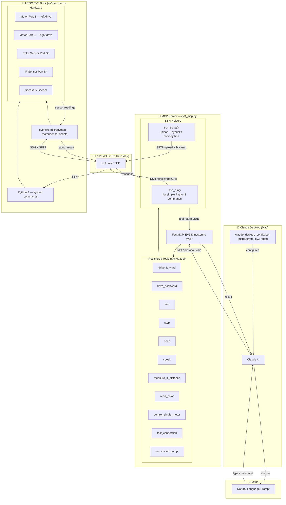

# BrickAgent - Connecting Claude to your Mindstorms EV3 Robot

Use the following approach to talk to your EV3 Robot via Claude:

1. [https://www.ev3dev.org](https://www.ev3dev.org/docs/getting-started/) - start your EV3 from SD card flashed with ev3dev Linux
2. Equip your EV3 with a wifi dongle to make it accessible in your WLAN
3. Clone the MCP server in this repo, adapt configuration
  
         # ─── Configuration ────────────────────────────────────────────────
         EV3_HOST = "robot IP"
         EV3_USER = "robot"
         EV3_PASS = "maker"          # Default ev3dev password
         
         WHEEL_DIAMETER_MM = 33.3    # Wheel diameter in mm (adjust if distance is off)
         AXLE_TRACK_MM     = 186     # Axle track in mm (adjust if turn angles are off)
   
4. Add the following to your claude_desktop_config.json to let Claude know about the MCP
   
        "mcpServers": {
             "ev3-robot": {
                "command": "<local-path>/ev3-env/bin/python",
                "args": ["<local-path>/ev3_mcp.py"]
        }
   
5. Verify Claude detects the MCP; need to restart Claude, then check in the chat input via clicking plus: _ev3-robot_ should show up under Connectors.
   
6. Ask Claude to check the connection to your ev3 

First fun thing to do is to ask the agent to let your robot "drive" letters on the floor and let you guess which one.
But essentially you can now completely use the agentic planning capabilities of Claude for chaining operation to achieve ends.
Sensors give you a feedback-loop. 

Disclaimer: run custom script is potentially dangerous. Claude may decide to let your robot drive over your feet.

## Notes
- [ev3dev-browser](https://marketplace.visualstudio.com/items?itemName=ev3dev.ev3dev-browser) may help debugging, you can connect via USB and ssh into the ev3 in VS Code if the WIFI setup fails for some reason
- for me, bluetooth failed as cable-less connection option as it seems in macOS Bluetooth PAN has been removed

## Architecture

